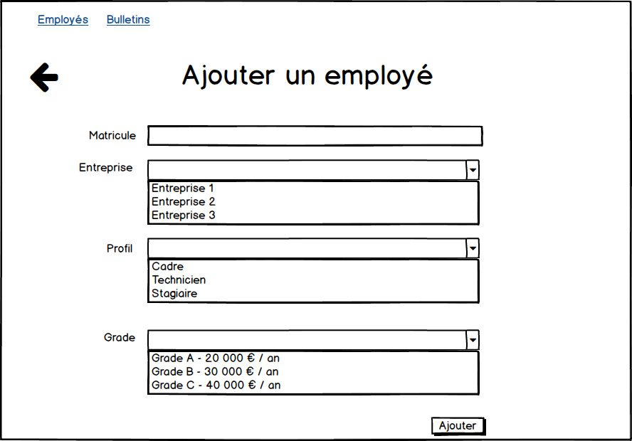

# paie-api

## lien heroku:
  lien:[paie-api](https://kseguineau-paie-api.herokuapp.com/entreprises)
  
## Conception Api 
  
  
### Back  

#### Information pour l’affichage du formulaire

Nous allons avoir besoin d’un controller EmployeController qui va écouter une requete GET "/referenciels".
Ce controller va ensuite récuperer la liste des entreprises via la méthode findEntreprises() de la 
classe EntrepriseService, puis la liste des profils via la méthode findProfils() de la classe ProfilService
et récuperer le grade via la méthode findGrade() de la classe GradeService. Le controller va ensuite instancier un 
objet InformationAjoutEmployeDto ayant pour attributs la liste des entreprises,la liste des profils et la liste des grades
qu’il va transmettre au front.  

exemple:
```json
{
  "entreprises" : [
      {
        "code" : "E1",
        "nom" : "Entreprise 1"
      },
      {
        "code" : "E2",
        "nom" : "Entreprise 2"
      },
      {
        "code" : "E3",
        "nom" : "Entreprise 3"
      }],
  "profil": [
      {
        "code": "cad",
        "nom": "Cadre"
      },
      {
        "code": "tech",
        "nom": "Technicien"
      },
      {
        "code": "sta",
        "nom": "Stagiaire"
      }],
  "grade" : [
      {
        "code": "A",
        "nom": "Grade A - 20 000€ / an"
      },
      {
        "code": "B",
        "nom": "Grade B - 30 000€ / an"
      },
      {
        "code": "C",
        "nom": "Grade C - 40 000€ / an"
      }]
}
```

#### Ajout d’un employé

Une méthode de EmployeController va écouter la requete Post "/remuneration-employe" prenant en parametre un employé
qui va le transmettre au service EmployeService qui va vérifier que les informations sont correctes, si elles le sont
il va ajouter à la base une RemunerationEmploye, sinon il renvoi une erreur.

exemple d’ajout d’employe:

```json
{
  "matricule": "482393882",
  "code_entreprise": "1",
  "code_profil": "tech",
  "code_grade": "B"
}
```

Exemple d’un retour erreur:

```json
{
  "code_erreur":"R_404",
  "message": "Employe introuvable"
}
```


  
  
  
